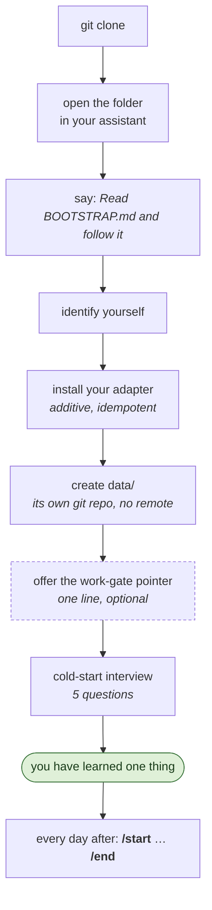
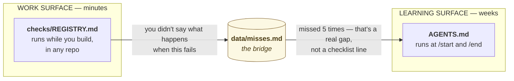
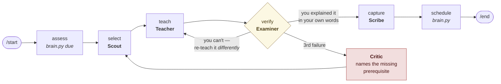
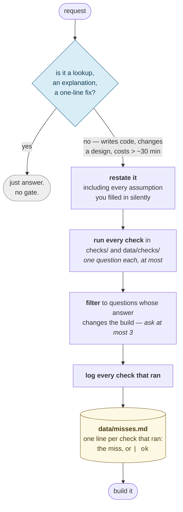
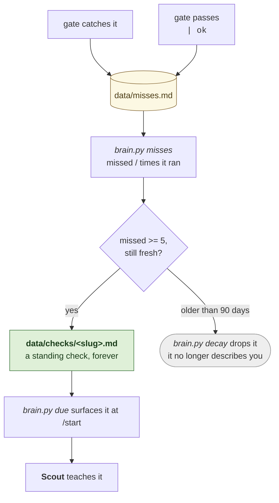

# brain

A mentor that lives in your repo and works with whatever AI assistant you already have.

Clone it. Point your assistant at it. It interviews you, finds what you don't know,
teaches you, tests whether it stuck, writes it down, and brings it back before you
forget it.

It also sits beside you while you work and asks the questions you forgot to ask —
then turns the ones you keep forgetting into lessons.

No API key. No pip install. No account. No network after the clone.
Works on a locked-down corporate laptop.

---

## Why this exists

Some engineers seem to implement, learn, and ship far more than the hours allow.
They aren't faster readers. Two things separate them:

1. **Their knowledge is connected.** A new problem lands next to five things they
   already know instead of on empty ground. That's compounding, and it's measurable
   — see [The knowledge graph](#the-knowledge-graph).
2. **Their state lives outside their head.** They get interrupted and lose nothing,
   because every loop they're running has a checkpoint on disk.
3. **They ask a different first question.** Not "how do I build this" but "what breaks,
   what does it cost, and how will we know." That's what makes them solve in minutes
   what took you hours — see [The work gate](#the-work-gate).

`brain` is built to produce all three on purpose instead of by luck.

## What this is not

- Not a note-taking app. It writes notes, but the notes are a side effect.
- Not an AI. It has no model. It *drives* the assistant you already have.
- Not a cloud service. Nothing leaves your machine.
- Not a syllabus. It teaches what your actual work exposes, plus what your target
  role needs and your work never shows you.

---

## Requirements

- Python 3.9+ (standard library only — nothing to install)
- git
- An AI coding assistant: **Claude Code, Cursor, GitHub Copilot, Codex, Gemini CLI,
  Windsurf, Zed, Aider,** or anything else that reads `AGENTS.md`

That's the whole list.

---

## Quick start

```bash
git clone <repo-url> brain
cd brain
```

Then open that folder in your assistant — Cursor, Claude Code, Copilot, whatever you
have — and say:

> Read BOOTSTRAP.md and follow it.

That is the whole setup:



The work-gate pointer is the only step that asks anything of you beyond answers: one
line pasted into your assistant's global settings, pointing at this clone, so the work
gate also runs in the repos you actually work in. Skip it and you lose only that — the
learning loop is unaffected.

**What the first session looks like.** Five questions about your work and where you
want to be, then it writes `data/target.md` and 8–12 skill files, then it teaches you
one thing and tests whether it stuck. Budget 20–30 minutes. You finish having learned
something, not having configured a tool.

Question 3 — *what do you nod along to in meetings without really following?* — is the
one that decides whether any of this is worth running. Answer it honestly. An inflated
skill map sends the system after the wrong things for months.

**The next day**, and every day after, two commands:

| Command | What happens |
|---|---|
| `/start` | Reads your brain. Gives you three things: one review that's due, one gap worth closing, one open question. |
| `/end` | Writes today's notes, updates your skill levels, schedules reviews, commits. |

If your assistant doesn't support slash commands, type `start` and `end`. `AGENTS.md`
defines both, so every assistant understands them.

---

## How it works

Two surfaces, one file joining them.




The work gate is fast and runs in minutes. The learning loop is slow and runs in weeks.
The fast one catches the miss; the slow one removes the reason for it. Neither works
alone: a nag you learn to click past changes nothing, and a lesson you never connect to
real work never gets used.

### Two repositories, on purpose

```
brain/                  <- the system. public. you pull updates. you never write here.
  AGENTS.md  brain.py  personas/  templates/  adapters/

  data/                 <- your brain. gitignored above. its own git repo. NO REMOTE.
    target.md  notes/  skills/  log/  questions.md  local/
```

This split does two jobs at once:

- **The outer repo holds no personal data**, so a `git pull` for system updates almost
  never touches anything you wrote. Not an absolute guarantee — `config.json` is tracked
  and `bootstrap` writes to it, so an upstream change to that one file can still
  conflict, and `bootstrap` drops untracked files (`CLAUDE.md`, `.claude/`, `.cursor/`,
  `.github/`) into the tree. Everything under `data/` is untouched either way.
- **The inner repo has no remote**, so `git push` fails with *"no configured push
  destination."* Your notes cannot be pushed anywhere by accident.

That second one matters on a work laptop. See [Using this at work](#using-this-at-work).

You still get commits, history, and undo on your own brain — locally.

### The day loop



**The verify step is the point.** Being taught something and being able to produce it
are different states, and only the second one lasts. The loop does not advance until
you can explain the thing in your own words without prompting. When you can't, it
teaches it again a *different* way — not louder, differently.

### Three loops, each with a checkpoint

| Loop | Cycle | Exits when | Checkpoint on disk |
|---|---|---|---|
| Inner (minutes) | teach → verify → re-teach | you explain it unprompted | note written |
| Day | `/start` → work → `/end` | commit exists | git commit |
| Review (spaced) | resurface → recall → re-schedule | skill hits level 5 | `next_review` in the skill file |

Every loop can be abandoned mid-way and resumed, because its state is a file, not a
conversation.

### The work gate

The learning loop handles *what you don't know*. This handles *what you know perfectly
well and forgot to think about at 2pm on a Thursday* — no tests, no rollback, three days
spent on a feature nobody measured.

It lives in [`checks/REGISTRY.md`](checks/REGISTRY.md) and runs in whatever repo you're
working in, not this one.



```
- 2026-09-20 tests | no failing case named
- 2026-09-20 cost | ok
```

**Both outcomes get logged.** The `ok` lines are the denominator. Five misses out of
five gates and five out of two hundred are different findings, and a log that records
only misses can't tell them apart — and can't be backfilled, because a gate that passed
leaves no other trace. `python brain.py misses` prints `missed / times the check ran`.

**The trigger rule is load-bearing.** A gate that fires on "what does this function do"
gets switched off in three days, and then it catches nothing. Lookups pass straight
through.

Three checks ship, and they run whether or not your prompt hints at them:

| Check | Asks |
|---|---|
| [tests](checks/tests.md) | how do we know it works, and how do we find out when it breaks |
| [cost](checks/cost.md) | is this worth it, and what's the smaller version |
| [operations](checks/operations.md) | what happens at 3am when it fails |

**They're fixed on purpose.** An assistant that invents personas from your problem
statement generates them from the same framing that contains the blind spot, so it
reproduces the miss instead of catching it. Unconditional checks are the only kind that
see what you didn't think to mention.

#### Promotion — how a miss becomes a lesson



Only unexpired misses count toward promotion. The question is whether you *still* do
this, not whether you once did — otherwise a habit you fixed two years ago promotes
itself into a permanent check.

Promotion counts raw misses, not the rate. The `ok` lines don't feed it yet — see
[Waiting on real use](#waiting-on-real-use).

Promoted checks land in `data/checks/`, never in the system repo. They're yours, and
they belong in the repo that has no remote.

### Decay — why the queue won't bury you

Most second brains die from an unbounded to-do queue. This one drains itself:

- A skill at level 5 leaves the review rotation.
- A question unanswered for 60 days closes as *"turned out not to matter."*
- A note never linked in 90 days becomes an archive candidate.
- A logged miss older than 90 days drops. It stops describing you.

Nothing accumulates forever. That's deliberate, and it's why the system survives a busy
month.

### The knowledge graph

Every note links to other notes and skills with `[[wikilinks]]`. A note with zero links
is rejected — if nothing connects, that's the finding, not a filing problem.

Once you have ~30 notes, `python brain.py graph` reports what you cannot see by
re-reading your own notes:

| Metric | What it means about you |
|---|---|
| **Orphans** | You memorized a fact, not a concept. Connect it or drop it. |
| **Hubs** | Your real foundations — measured, not as you imagine them. |
| **Frontier** | Unlearned skills adjacent to your hubs. The cheapest next lesson with the highest chance of sticking. |
| **Bridges** | Notes joining two clusters. The closest measurable proxy for senior-engineer range. |

**Frontier is the honest answer to "what should I learn next?"** — better than a
syllabus, better than a hunch.

### Personas

The workflow above is a graph, and its nodes are personas. A persona is only useful if
it has a different *contract*, not a different voice. "Now be skeptical" is theater.
"You may read only these five notes and must output three falsifiable questions" is a
function.

| Persona | Gets | Must produce | Forbidden from |
|---|---|---|---|
| **Scout** | `target.md` + skill graph | one skill to attack, with the reason | teaching |
| **Teacher** | that skill | explanation + worked example | asking questions |
| **Examiner** | the concept only — *not* Teacher's reasoning | 3 questions requiring production, not recognition | giving answers |
| **Scribe** | the exchange | a note with `[[links]]` | adding new content |
| **Critic** | your notes | where you're fooling yourself | being encouraging |
| **Archivist** | the whole graph | orphans, bridges, decay actions | teaching |

The **forbidden** column is what makes these real. Examiner not seeing Teacher's
reasoning is what makes the test fair.

Today the personas run sequentially in one conversation on every assistant, and the
isolation is instructed rather than enforced — including Examiner not reading Teacher's
reasoning. That is a real limitation: an instruction to ignore what you just read is
weaker than never having read it.

On an assistant with genuine subagents, running each persona in its own context would
enforce it. Nothing shipped here does that yet.

---

## Cold start

A fresh clone has an empty brain. There is nothing to reason over, so the first
`/start` is an **interview, not a dashboard**. Five questions:

1. What do you actually do all day?
2. What do you want to be doing in 18 months?
3. What do you nod along to in meetings without really following?
4. What have you tried to learn and dropped? Why?
5. How much time per day, honestly?

From those it writes `target.md` and seeds 8–12 skill files at honest levels — then
teaches you one thing immediately.

Answer question 3 truthfully. It's the one that makes this worth running.

---

## Using this at work

Designed for a laptop you don't own.

**Nothing to install.** Python stdlib and git. No pip, no model download, no network
call after the clone. Nothing for IT to approve or block.

**Your employer's information never enters git.** Every `/end` splits what it captured:

| Goes to | Contains | In git |
|---|---|---|
| `data/notes/` | the **concept**, employer-free — *"async task starvation when a sync call blocks the loop"* | yes (local only) |
| `data/local/` | the **context** — ticket IDs, internal service names, their code | **never**, gitignored twice |

The knowledge is yours and comes with you. The specifics stay on the machine.

**You cannot push by accident.** `data/` has no git remote. There is no policy to
remember and no hook to bypass — the operation has nowhere to go.

**If your machine is reimaged, your brain is gone.** That is the accepted trade for not
moving work-derived material off a corporate device. Know it going in.

### If you *are* allowed to back up your brain

On a machine where that's fine — your own — opt in with one command:

```bash
cd data && git remote add origin <your-private-repo>
```

Use a **private** repo. Everything else is unchanged.

---

## Switching assistants

Adapters are additive. Bootstrap installs the key for whichever assistant is running
and **touches no other**. Use Cursor in March and Claude in June and both adapters sit
in the repo; switch back and yours is still there. Running bootstrap twice changes
nothing.

Your data doesn't move or convert — it's plain markdown in `data/`, and the new
assistant reads it directly. `data/HANDOVER.md`, written by every `/end`, carries only
the **in-flight session state**: what was mid-teach, which question is still open, what
was about to happen. Not your knowledge — that's already on disk.

| Assistant | Instructions read from | Commands installed to |
|---|---|---|
| Codex, Aider, Zed, Windsurf, Devin | `AGENTS.md` (native) | — |
| Cursor | `AGENTS.md` (native) | `.cursor/commands/` |
| Claude Code | `CLAUDE.md` → `@AGENTS.md` | `.claude/commands/` |
| GitHub Copilot | `.github/copilot-instructions.md` | `.github/prompts/` |
| Gemini CLI | `GEMINI.md` | — (type `start` / `end`) |

`AGENTS.md` is the single source of truth. Every other file is a one-line pointer to
it, so there is nothing to keep in sync.

---

## Commands

```
python brain.py init              Create data/, its git repo, and the starting files
python brain.py bootstrap <name>  Install that assistant's adapter (additive, idempotent)
python brain.py due               Today's briefing: reviews due, top gap, oldest question
python brain.py graph             Orphans, broken links, hubs, frontier, bridges
python brain.py decay             What should leave the system
python brain.py misses            Per check: missed / times it ran, and what to promote
python brain.py schedule <slug> pass|fail   Record a review outcome, reschedule the skill
python brain.py migrate           Move folders to match config.json, verifying links
python brain.py selftest          Verify date math, parsing, graph metrics, idempotence
```

`<name>` is one of `claude`, `cursor`, `copilot`, `gemini`. The script does no detection
— your assistant states which one it is and passes the name, per `BOOTSTRAP.md`.

**`brain.py` never edits your notes.** It computes facts and reports them; the assistant
does the writing. `decay` lists what should leave the system, it does not remove
anything — the Archivist decides, and its contract forbids deleting without asking.

`brain.py` is standard library only and cross-platform. Run `selftest` after any edit.

---

## Layout

```
brain/
  README.md            this file
  BOOTSTRAP.md         what a new assistant reads first
  AGENTS.md            THE protocol — read by 30+ assistants natively
  DECISIONS.md         every design decision and why, including what was rejected
  brain.py             the engine. stdlib only.
  config.json          paths and policy. the only file bootstrap edits.
  personas/            scout, teacher, examiner, scribe, critic, archivist
  checks/              THE WORK GATE — registry, tests, cost, operations
  templates/           note, skill, log, interview
  adapters/            per-assistant command templates
  docs/design.md       full architecture

  data/                yours. gitignored. own git repo, no remote.
    target.md          target role and ranked gaps
    state.json         where each loop stopped
    HANDOVER.md        in-flight session state
    notes/             YYYY-MM-DD-slug.md, one concept each, [[linked]]
    skills/            one file per skill: level 0-5, evidence, next_review
    log/               one file per day
    questions.md       open queue
    misses.md          every gate firing, caught or `| ok`. bridges the two loops.
    checks/            your promoted checks. written by you, not shipped.
    local/             employer specifics. never in git, anywhere.
```

---

## Customizing

**Renaming folders:** change `config.json`, never paths in code. Then run
`python brain.py migrate`, which moves the folders with `git mv` so history survives.
Your `[[links]]` need no rewriting — link targets are file stems, so a folder move
leaves them all valid, and `migrate` verifies that rather than assuming it.

`notes`, `skills`, `log`, and `checks` are renameable this way. `data` and `local` are **pinned**
— renaming either one is rejected with a warning and falls back to the default, because
the outer `.gitignore` matches the literal string `data/` and `data/.gitignore` matches
the literal string `local/`; renaming either would silently drop a gitignore layer and
risk pushing notes into the public repo.

Paths must stay relative, use forward slashes, and live inside your data root. Anything
else is rejected with a warning and falls back to the default — that rule is what keeps
your notes inside the repo that has no remote.

**Editing `brain.py`:** it's yours. Run `python brain.py selftest` afterwards.

**Changing how it teaches:** `AGENTS.md` and `personas/` are plain markdown. The
workflow graph is a table you can edit. Changing teaching policy means editing a table,
not rewriting a prompt and hoping.

---

## Why no LangChain or LangGraph

Both need *your Python process to call an LLM.* Here the model lives inside your
assistant and isn't reachable from your code, so there'd be nothing to call —
structurally inert, not merely heavy. And `pip install langchain langgraph` pulls 100+
transitive packages onto a machine under proxy and security scanning.

Their good ideas cost nothing to keep: explicit state object, nodes as pure functions,
conditional edges, a checkpointer for durable resume. All of that is here, in markdown
and stdlib Python.

Because the graph is declared as **data**, porting to real LangGraph the day you get an
API key is transcription, not redesign.

---

## Waiting on real use

Everything below is designed, not built. Each one is deferred on purpose, and each has a
condition that decides it — not an opinion, an observation you can make from your own
log.

**The rule: nothing here gets built until two weeks of real sessions have run.** Zero
sessions have run so far. Every item is a guess about which part will break first, and
guesses made before the first week are usually wrong about the ordering.

| Deferred | Build it when | Why not now |
|---|---|---|
| **Rate-based promotion** — promote on missed/fired, not a raw count of 5 | `brain.py misses` visibly misranks: a check at 5/5 sorts below one at 6/180 | A conservative bound (Wilson, used by [open-second-brain](https://github.com/itechmeat/open-second-brain)) is ~20 lines of statistics on data you don't have yet. The `ok` lines are being recorded from day one precisely so this stays possible later. |
| **Auto-close a promoted check** | a check in `data/checks/` has logged `\| ok` on every gate for a month | A promoted check is currently permanent. It shouldn't be — a habit you fixed should stop being asked about. Needs the denominator to have collected something first. |
| **Retire with a reason** instead of dropping | you look at `decay` output and want to know what it already discarded | `decay` drops expired misses into nothing. Moving them to `data/retired/` with a reason makes decay auditable. Cheap whenever you want it; nothing depends on it. |
| **Blocking verify** | Examiner passes you on something you can't do a week later | Today a tired "yes, that makes sense" clears the gate. [Covate](https://covate.org) blocks the assistant until you actually pass. Sound idea; unproven that the soft version fails. |
| **A single priority score for Scout** | Scout picks something obviously wrong twice | `priority = (1 - confidence) × (days_since_practice + 1) × weight`, from [learn-anything](https://github.com/ChenChenyaqi/learn-anything). One line. Scout currently combines graph metrics and due dates with no explicit rule, which is fine until it isn't. |
| **Personas synthesized per problem** | the three fixed checks prove they get used, and feel too narrow | Your original proposal. Still the bet against it: a persona generated from your problem statement inherits the framing the blind spot lives in. Revisit with evidence, not before. |
| **Persona isolation in subagents** (ADR-024) | context bleed between personas actually shows up in a session | Isolation is instructed, not enforced. Nothing in the repo does it, and the README says so rather than implying otherwise. |
| **`brain.py week`, staleness line, capturing the answer at verify, `export --safe`** | one of them is the thing you reach for and find missing | Four earlier ideas, all plausible, none load-bearing. A system with zero sessions doesn't need more surface. |

Explicitly **not** planned: an `install.lock.json` adapter manifest. `bootstrap` only
writes files inside this clone, so git already records exactly what it added and
`git clean` removes it. Tools that need a lockfile need one because they mutate MCP
configs and editor settings outside their own folder. This one doesn't.

---

## Troubleshooting

**`/start` does nothing** — your assistant may not support slash commands. Type `start`.

**Assistant ignores the rules** — confirm the adapter for *your* tool exists
(`python brain.py bootstrap <name>` — `claude`, `cursor`, `copilot`, or `gemini`; running
it with no name exits 2), and that you opened the `brain/` folder itself as the
workspace root, not a parent directory.

**"No data yet"** — run `python brain.py init`.

**Reviews never come due** — check `next_review` in `data/skills/`. Then
`python brain.py selftest` to confirm the date math.

**`git push` fails in `data/`** — working as designed. See
[Using this at work](#using-this-at-work).

**The work gate never fires** — it only runs in repos other than this one, and only if
you pasted the pointer line into your assistant's *global* settings during bootstrap.
Repo-level instructions won't do it. Re-read `BOOTSTRAP.md` step 5. If it fires on
everything instead, the trigger rule in `checks/REGISTRY.md` is being ignored — say
"lookup only, no gate" and it should pass straight through.

**`promote:` never appears** — either nothing is writing `data/misses.md`, or you're
genuinely not missing anything. Run `python brain.py misses`: rows like `0 / 9` mean the
gate is running and finding nothing, which is the good outcome. `misses: none logged`
means it isn't running at all. Check the file exists and has lines in the documented
shape: `- YYYY-MM-DD check-slug | text`, or `| ok` for a check that passed.

---

## Design decisions

Every decision, its rationale, and the alternatives that were rejected:
[DECISIONS.md](DECISIONS.md). Read it before proposing a change — the rejected options
are the useful part.
